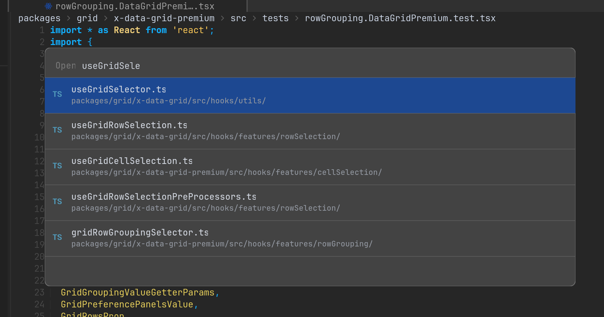
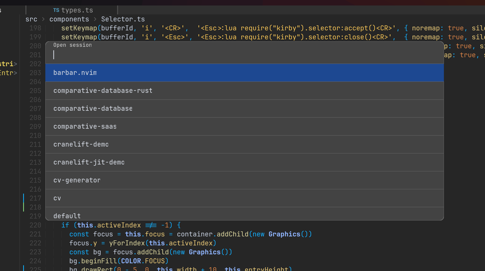

# kirby.nvim

Fuzzy picker based on [kui.nvim](https://github.com/romgrk/kui.nvim).




This plugin depends on the ones listed below. If you're using lazy.nvim, you can use the config below.
It also has the following hard dependencies that you need to ensure.
 - POSIX-compliant enough OS
 - libcairo
 - terminal with kitty graphics protocol support

```lua
{ 'romgrk/kirby.nvim', dependencies = {
    { 'romgrk/fzy-lua-native', build = 'make install' },
    { 'romgrk/kui.nvim' },
    { 'nvim-tree/nvim-web-devicons' },
  },
},
```

## Usage

This plugin maps `<C-p>` to opening the file picker, unless that key is already mapped.
You can create your own mapping by using the command `:Kirby file`.

Use the `:Kirby [picker-id]` command to open a picker.

### Default pickers

#### `Kirby file [directory]`

Select files in the (current) directory. Uses `fd` if available, otherwise `git ls-files`.

#### `Kirby ctags-current-file`

Select ctags for the current file. Requires `universal-ctags`.

## Adding pickers

A few examples from my own config:

```lua

local kirby = require('kirby')

kirby.register({
  id = 'git-branch',
  name = 'Git checkout',
  values = function() return vim.fn['fugitive#CompleteObject']('', ' ', '') end,
  onAccept = 'Git checkout',
})

kirby.register({
  id = 'session',
  name = 'Open session',
  values = function() return vim.fn['xolox#session#complete_names']('', 'OpenSession ', 0) end,
  onAccept = 'OpenSession',
})

kirby.register({
  id = 'note',
  name = 'Open note',
  values = function() return vim.fn['xolox#notes#cmd_complete']('', 'Note ', 0) end,
  onAccept = 'Note',
})
```

See [types.ts](./src/types.ts) for configuration options.


## License

JSON license (MIT license + non-evilness clause)
